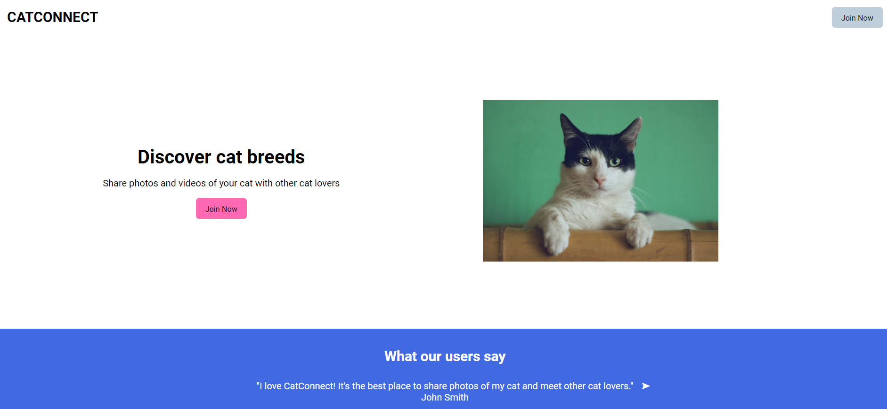

<<<<<<< HEAD

# Cats Room

## Descrição:

Cats Room é um projeto de rede social dedicado aos amantes de gatos. Ele permite que os usuários compartilhem fotos, vídeos e histórias de seus gatos, se conectem com outros donos de gatos e aprendam mais sobre diferentes raças de gatos.

## Recursos:

### Cadastro de Usuário:

Os usuários podem se cadastrar na plataforma fornecendo um nome, endereço de e-mail e senha.

### Autenticação:

Os usuários podem fazer login na plataforma usando seu endereço de e-mail e senha.

### Perfil do Usuário:

Cada usuário tem um perfil onde podem adicionar uma foto de perfil, uma biografia e visualizar os gatos que adicionaram à plataforma.

### Compartilhamento de Conteúdo:

Os usuários podem compartilhar fotos, vídeos e histórias de seus gatos com outros usuários da plataforma.

### Explorar Gatos:

Os usuários podem explorar diferentes raças de gatos e aprender mais sobre elas.

### Conexão Social:

Os usuários podem seguir outros usuários, curtir e comentar em suas postagens, e enviar mensagens diretas.

## Tecnologias Utilizadas:

Frontend: HTML, CSS, JavaScript
Backend: PHP
Banco de Dados: MySQL
Bibliotecas/Recursos Adicionais: PHP Mailer (para envio de e-mails), PHP Password Hashing (para segurança de senhas)
Instruções de Instalação:

Clone o repositório do projeto para sua máquina local.
Importe o banco de dados fornecido (cats_room.sql) para seu servidor MySQL.
Configure as credenciais do banco de dados no arquivo db.php.
Certifique-se de ter um servidor web (como Apache) e PHP instalados em sua máquina.
Inicie o servidor web e acesse o projeto em seu navegador.

## Desenvolvedor:

Gabriela Alvarenga

## Licença:

Este projeto está licenciado sob a Licença MIT.

## Contato:

Para relatar problemas, solicitar novos recursos ou obter mais informações, entre em contato conosco em contato@catsroom.com.
=======

# Cats Room [in progress]

## Description:

Cats Room is a social networking project dedicated to cat lovers. It allows users to share photos, videos, and stories of their cats, connect with other cat owners, and learn more about different cat breeds.

## Features:

### User Registration:

Users can register on the platform by providing a name, email address, and password.

### Authentication:

Users can log in to the platform using their email address and password.

### User Profile:

Each user has a profile where they can add a profile picture, a biography, and view the cats they have added to the platform.

### Content Sharing:

Users can share photos, videos, and stories of their cats with other platform users.

### Explore Cats:

Users can explore different cat breeds and learn more about them.

### Social Connection:

Users can follow other users, like and comment on their posts, and send direct messages.

## Technologies Used:

Frontend: HTML, CSS, JavaScript
Backend: PHP
Database: MySQL
Additional Libraries/Resources: PHP Mailer (for email sending), PHP Password Hashing (for password security)

## Installation Instructions:

1. Clone the project repository to your local machine.
2. Import the provided database (cats_room.sql) to your MySQL server.
3. Configure the database credentials in the db.php file.
4. Make sure you have a web server (such as Apache) and PHP installed on your machine.
5. Start the web server and access the project in your browser.

## Developer:

Gabriela Alvarenga

## License:

This project is licensed under the MIT License.

## Contact:

To report issues, request new features, or get more information, please contact us at contact@catsroom.com.
>>>>>>> 266f8be2bfc00639d3d8cdef0b9002a8750efb8c
